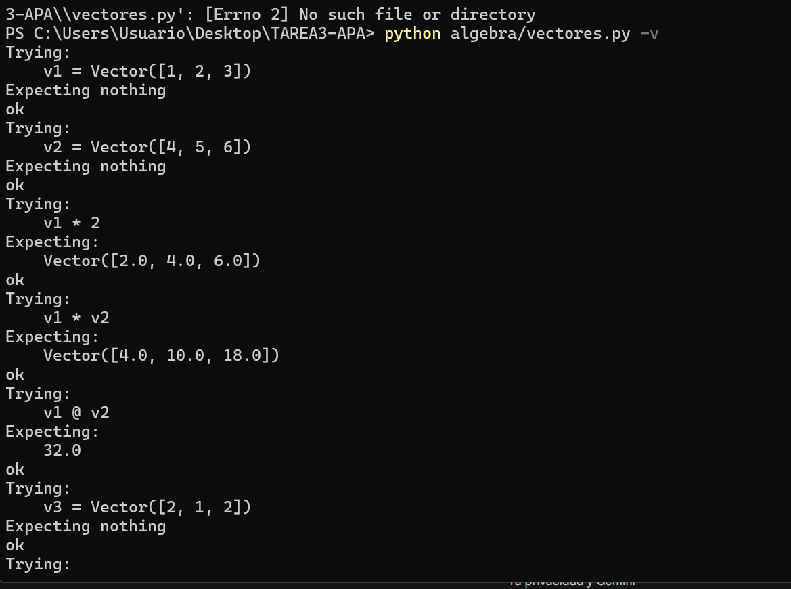
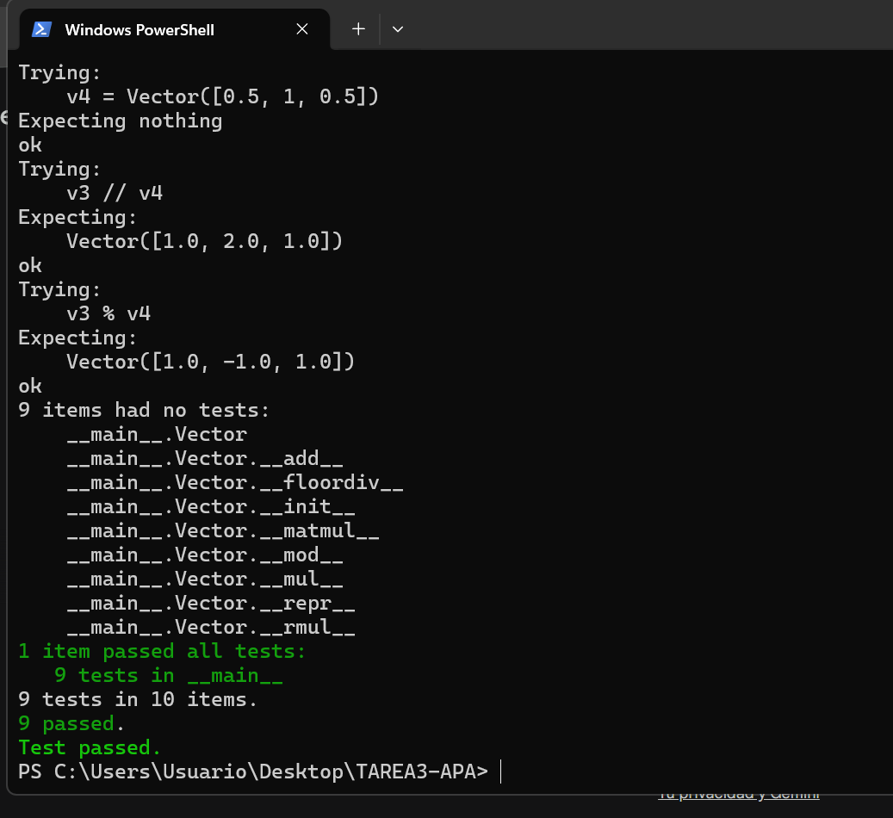

# Tarea 3 APA: Multiplicación de vectores y ortogonalidad

**Nombre:** Albert Blazquez Badenas


## Descripción de la tarea
El objetivo de esta práctica es implementar en Python, mediante Programación Orientada a Objetos, diversas operaciones de álgebra lineal sobre una clase `Vector`. Se ha evitado el uso de bibliotecas externas como NumPy, cumpliendo con los requisitos de la asignatura.

### Operaciones implementadas:
* **Producto de Hadamard (`*`)**: Multiplicación elemento a elemento entre dos vectores.
* **Multiplicación por escalar (`*`)**: Producto de un número por cada componente del vector.
* **Producto escalar (`@`)**: Suma de los productos de las componentes.
* **Componente paralela (`//`)**: Proyección tangencial de un vector sobre otro.
* **Componente normal (`%`)**: Componente perpendicular resultante de la descomposición ortogonal.

---

## Ejecución de los tests unitarios
Se han incluido pruebas unitarias utilizando el módulo `doctest`. A continuación, se muestra la captura de pantalla de la ejecución en modo verboso (`-v`), certificando que todos los tests han sido superados correctamente:




---

## Código desarrollado
A continuación, se muestra el fragmento de código correspondiente a la sobrecarga de los operadores solicitados en la tarea:

```python
    def __mul__(self, otro):
        """Producto de Hadamard o multiplicación por escalar."""
        if isinstance(otro, (int, float)):
            return Vector([a * otro for a in self.componentes])
        elif isinstance(otro, Vector):
            return Vector([a * b for a, b in zip(self.componentes, otro.componentes)])
        return NotImplemented

    def __matmul__(self, otro):
        """Producto escalar."""
        return sum(a * b for a, b in zip(self.componentes, otro.componentes))

    def __floordiv__(self, otro):
        """Componente paralela (tangencial)."""
        factor = (self @ otro) / (otro @ otro)
        return otro * factor

    def __mod__(self, otro):
        """Componente normal (perpendicular)."""
        v_paralelo = self // otro
        return Vector([a - b for a, b in zip(self.componentes, v_paralelo.componentes)])
